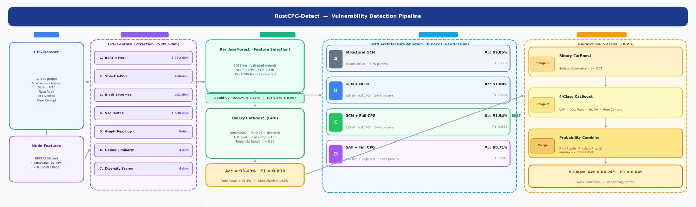

# RustCPG-Detect 🦀
**CPG-Enhanced Vulnerability Detection in Rust using Graph Neural Networks**

*Extending Rust-IR-BERT with Code Property Graphs, GNN Ablation Studies, and Fine-Grained 5-Class Vulnerability Classification*

[](https://python.org)
[](https://pytorch.org)
[](https://catboost.ai)
[](https://www.kaggle.com/datasets/kaarthikeyaganji/cid-i2)
[](LICENSE)

---

<!--
  ┌─────────────────────────────────────────────────────────────────────────┐
  │  PIPELINE DIAGRAM — HOW TO ADD                                          │
  │                                                                         │
  │  The architecture image is in assets/architecture.png                  │
  │  If it doesn't render on GitHub, try:                                   │
  │    1. Re-export Slide 10 from assets/RustCPG_Detect_Presentation.pptx  │
  │       as a PNG (1920×1080 recommended)                                  │
  │    2. Save to assets/architecture.png and git push                      │
  │    3. Uncomment the line below:                                         │
  │                                                                         │
  │                                     │
  │                                                                         │
  │  Or link directly to the Kaggle notebook screenshot:                    │
  │                     │
  └─────────────────────────────────────────────────────────────────────────┘
-->

> **Pipeline diagram:** See `assets/architecture.png` — or open `assets/RustCPG_Detect_Presentation.pptx` → Slide 10 for the full annotated system architecture.

---

## Results at a Glance

| Model | Accuracy | Macro F1 | Notes |
|---|---|---|---|
| Base Paper (Rust-IR-BERT) | 98.11% | 97.14% | On their own 2,305-sample dataset |
| Base config on our data | 91.70% | 84.81% | Same method, our harder dataset |
| **CPG-Enhanced Binary (Ours)** | **93.49%** | **0.896** | **Core contribution** |
| GNN Ablation Winner (GCN+CPG) | 91.94% | 0.8691 | Variant C |
| 5-Class HCPG (Novel Extension) | 64.24% | 0.649 | First-of-its-kind for Rust |
| **3-Fold Cross-Validation** | **92.47% ± 0.47%** | **0.879 ± 0.007** | Proven stability |

> **Why is our accuracy lower than the base paper?** Our dataset is 14× larger and significantly harder — 32,510 samples vs their 2,305. Direct comparison is not valid.
> See `base_paper_implementation/BASE_PAPER_EXPLAINER.md` for the full explanation.

---

## Repository Structure

```
RustCPG-Detect/
│
├── README.md                              ← This file
├── requirements.txt
├── .gitignore
├── LICENSE
├── KAGGLE_AND_SETUP_GUIDE.md             ← Full step-by-step run instructions
│
├── base_paper_implementation/            ← BASE PAPER FOLDER
│   ├── BASE_PAPER_EXPLAINER.md           ← Pipeline, results, context, comparison
│   └── base_paper_code.py                ← Complete runnable reproduction code
│
├── notebooks/
│   ├── 01_dataset_generation.ipynb       ← How the CPG dataset was built
│   ├── 02_baseline_rust_ir_bert.ipynb    ← Base paper notebook version
│   ├── 03_rustcpg_detect_pipeline.ipynb  ← MAIN: full CPG pipeline + CatBoost
│   ├── 04_gnn_ablation_study.ipynb       ← All 4 GNN variants (A→B→C→D)
│   └── 05_results_and_comparison.ipynb   ← Final metrics + all plots
│
├── src/
│   ├── parser.py          ← LLVMIRParser (Function/BasicBlock/Instruction)
│   ├── features.py        ← 67-dim structural feature extractor
│   ├── cpg_builder.py     ← CPG graph → PyTorch Geometric Data object
│   ├── embeddings.py      ← GraphCodeBERT embedding wrapper
│   ├── models.py          ← GNN variants: StructuralGCN, GCNWithBERT, GATFullCPG
│   └── __init__.py
│
├── results/
│   ├── ablation_results.csv
│   ├── classification_report_baseline.txt
│   ├── classification_report_rustcpg.txt
│   └── figures/                          ← Generated plots (after running notebooks)
│
└── assets/
    ├── architecture.png                  ← Pipeline diagram
    └── RustCPG_Detect_Presentation.pptx  ← Full project presentation
```

---

## Dataset

Hosted on Kaggle (~2 GB):

**https://www.kaggle.com/datasets/kaarthikeyaganji/cid-i2**

| Property | Value |
|---|---|
| Total samples | 32,510 CPG graphs |
| Classes | 5 (perfectly balanced) |
| Samples per class | 6,502 |
| Node feature dims | 835 (768 BERT + 67 structural) |
| Full CPG feature vector | 5,093-dim |
| Sources | RustSec Advisory DB, OSV Database, GitHub |

**Vulnerability classes:**

| Label | Class | Description |
|---|---|---|
| 0 | Safe | No vulnerability |
| 1 | UAF | Use-After-Free |
| 2 | Data Race | Concurrent unsynchronised memory access |
| 3 | Int Overflow | Integer overflow / underflow |
| 4 | Mem Corrupt | Memory corruption |

```bash
kaggle datasets download -d kaarthikeyaganji/cid-i2
```

---

## System Architecture

```
Stage 1 — LLVM IR Compilation
    Rust source (.rs)  →  rustc --emit=llvm-ir  →  .ll file
    Strips syntax, exposes raw memory operations explicitly

Stage 2 — CPG Feature Extraction  →  5,093-dim vector
    ├── BERT 4-Pool       (3,072-dim)  mean / max / std / min of BERT embeddings
    ├── Structural 4-Pool (  268-dim)  mean / max / std / sum of structural feats
    ├── Block Extremes    (  201-dim)  hotspot + entry + exit blocks
    ├── Sequence Deltas   (1,536-dim)  inter-block BERT differences
    ├── Graph Topology    (    8-dim)  nodes, edges, CFG/DFG ratios
    ├── Cosine Similarity (    4-dim)  inter-block semantic similarity
    └── Diversity Scores  (    4-dim)  structural diversity stats

Stage 3 — Random Forest Feature Selection
    5,093-dim  →  Top 2,000 features by importance  →  noise reduction

Stage 4 — Binary CatBoost  (iterations=2000, depth=8, AUC eval)
    Threshold tuned on validation set  →  t* = 0.71
    Output: Safe / Vulnerable

Stage 5 — 4-Class CatBoost  (if Vulnerable)
    UAF / Data Race / Integer Overflow / Memory Corruption

Stage 6 — Probability Combine (HCPG)
    P_final = [P_safe, P_vuln × P_type]  →  argmax  →  label (0–4)
```

For the annotated visual: `assets/architecture.png` or Slide 10 in the presentation.

---

## GNN Ablation Study

| Variant | Architecture | Accuracy | Macro F1 | Params |
|---|---|---|---|---|
| A | Structural GCN (66-dim struct only) | 89.85% | 0.8319 | 8,706 |
| B | GCN + BERT (835-dim) | 91.88% | 0.8673 | 264,450 |
| **C ✅** | **GCN + full CPG (835-dim)** | **91.94%** | **0.8691** | **264,450** |
| D | GAT + full CPG (835-dim + attention) | 90.71% | 0.8398 | 574,530 |

**Finding:** Variant C is the optimal architecture. GAT (Variant D) uses 2.2× more parameters yet underperforms — the CPG edge structure is already expressive enough that learned attention adds noise rather than signal.

---

## Quick Start

```bash
# 1 — Clone
git clone https://github.com/KK-College/RustCPG-Detect.git
cd RustCPG-Detect

# 2 — Install dependencies
pip install -r requirements.txt

# 3 — Download dataset
kaggle datasets download -d kaarthikeyaganji/cid-i2
unzip cid-i2.zip -d data/

# 4 — Run the main notebook
jupyter notebook notebooks/03_rustcpg_detect_pipeline.ipynb
```

For full setup instructions (Kaggle / Colab / Local + common errors): **[KAGGLE_AND_SETUP_GUIDE.md](KAGGLE_AND_SETUP_GUIDE.md)**

For base paper reproduction: **[base_paper_implementation/](base_paper_implementation/)**

---

## Detailed Results

### Binary Classification — Core Result

```
CORE RESULT — Enhanced Binary CatBoost (CPG Features, threshold = 0.71)
=========================================================================
Accuracy  : 93.49%    Macro F1     : 0.896
Vuln Recall: 96.8%    False-Alarm  : 19.5%

              precision    recall    f1-score
        Safe       0.98      0.80      0.88
  Vulnerable       0.93      0.99      0.96
```

### 3-Fold Cross-Validation

```
Fold 1: Acc = 0.9272    F1 = 0.8837
Fold 2: Acc = 0.9289    F1 = 0.8849
Fold 3: Acc = 0.9181    F1 = 0.8688

CV Accuracy : 0.9247 ± 0.0047
CV Macro F1 : 0.8791 ± 0.0073
```

### 5-Class Hierarchical Extension (Novel)

```
Stage 1 Binary + Stage 2 Type Classification
Accuracy : 64.24%    Macro F1 : 0.649
(No prior Rust work attempts multi-class vulnerability type classification)
```

---

## Five Novelties

1. **CPG-Enhanced Feature Space** — 5,093-dim vector combining 7 pooling strategies. First Rust detector to combine CPG structural features with transformer embeddings.

2. **Systematic GNN Ablation** — First study to ablate GCN vs GAT on Code Property Graphs for Rust, quantifying each component's contribution.

3. **5-Class Hierarchical Pipeline** — Novel 2-stage CatBoost for fine-grained vulnerability type classification. No prior Rust work does this.

4. **Largest Balanced Rust Dataset** — 32,510 perfectly balanced samples across 5 classes (14× larger than base paper).

5. **Threshold Optimization Generalized** — Demonstrated F1-sweep tuning works beyond BERT-only embeddings (optimal shifts from 0.35 → 0.71 with CPG features).

---

## Base Paper

This project extends:

> **Rust-IR-BERT: Vulnerability Detection in Rust via LLVM IR and GraphCodeBERT**
> Machine Learning and Knowledge Extraction, 2025, 7, 79
> DOI: https://doi.org/10.3390/make7030079

Full reproduction + explanation: [`base_paper_implementation/`](base_paper_implementation/)

---

## Team

| Name | 
| Kaarthikeya Lakshman Ganji 
| Guditi Sai Kaushik 
| Putrevu Venkata Sesha Sai Pranav 

---

## License

MIT — see [LICENSE](LICENSE) for details.
